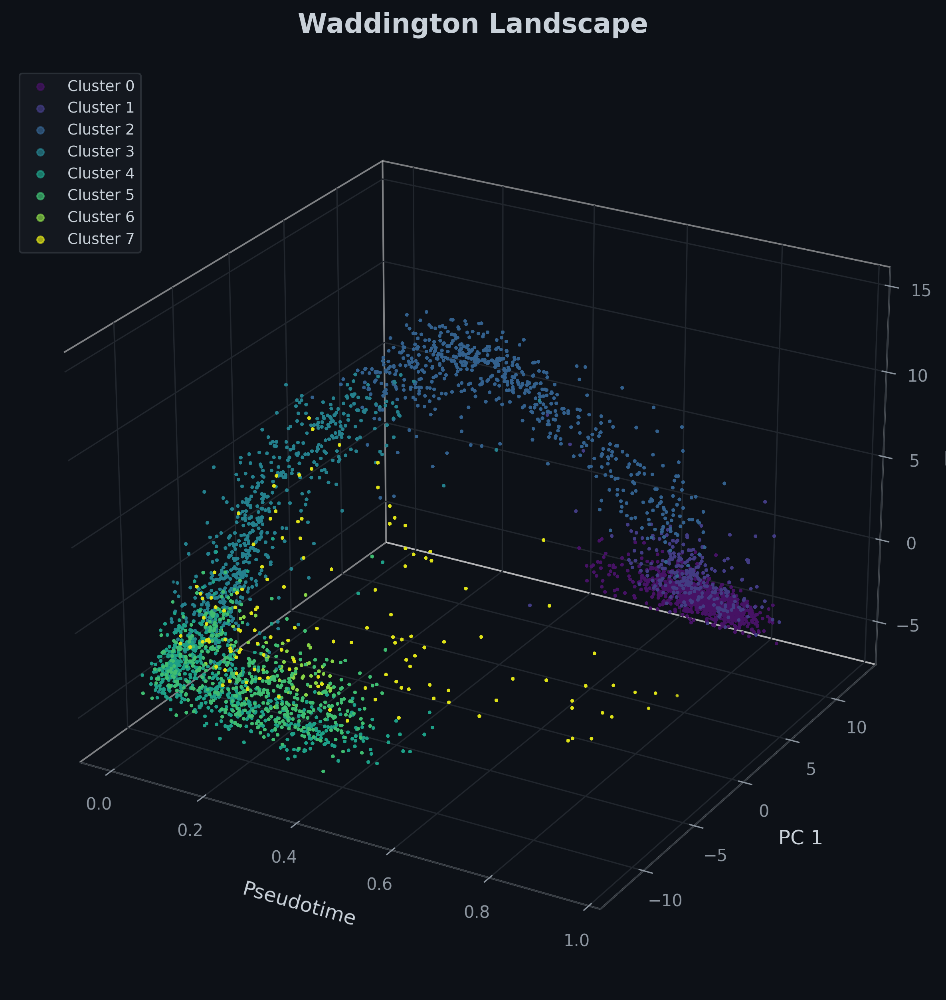
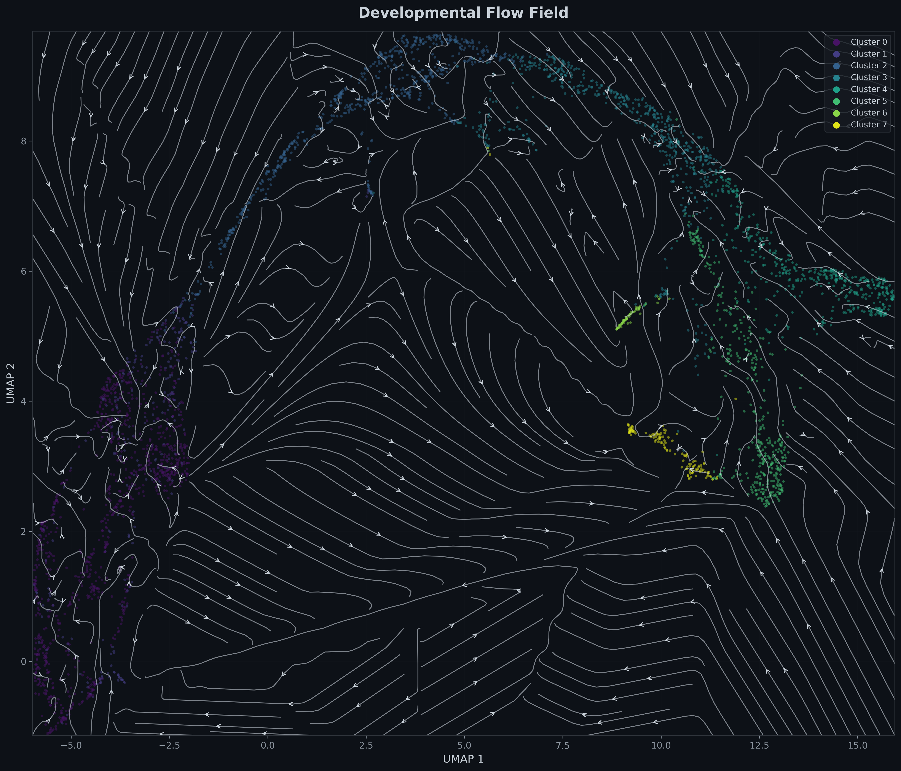
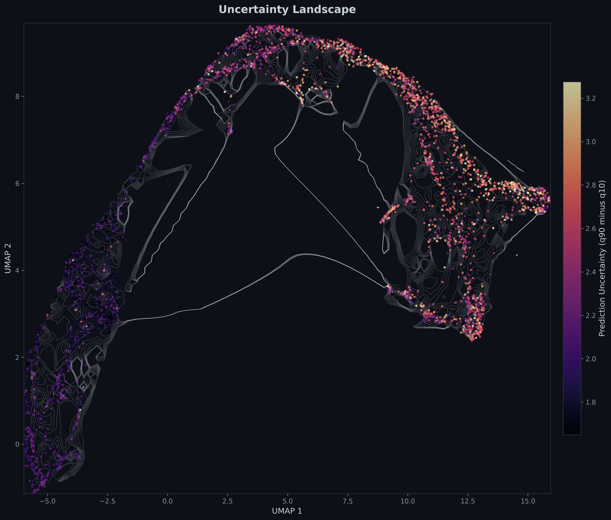
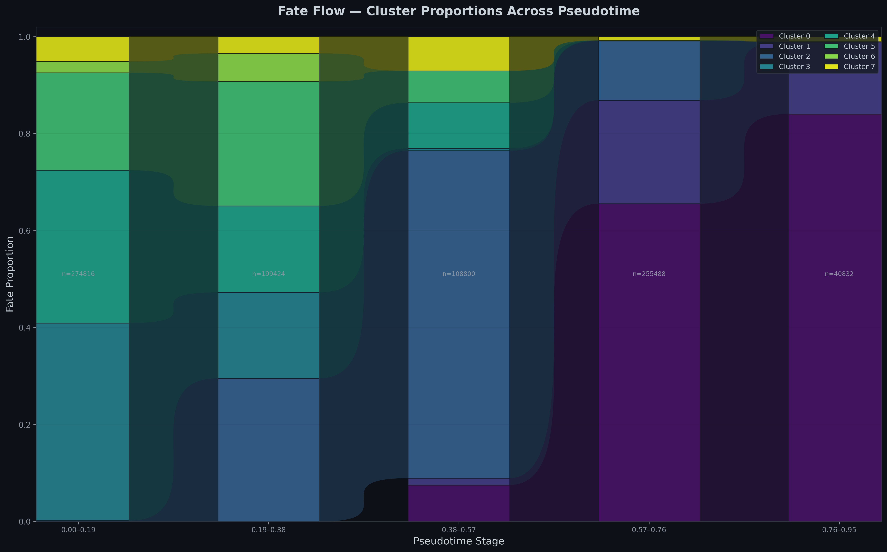
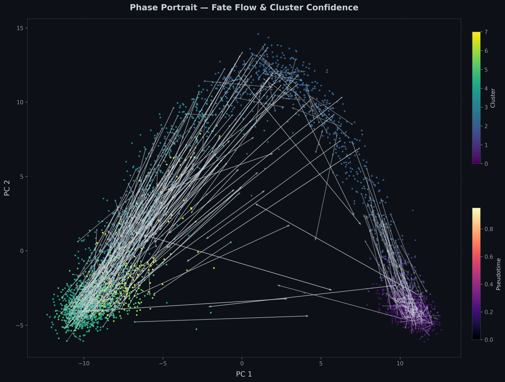
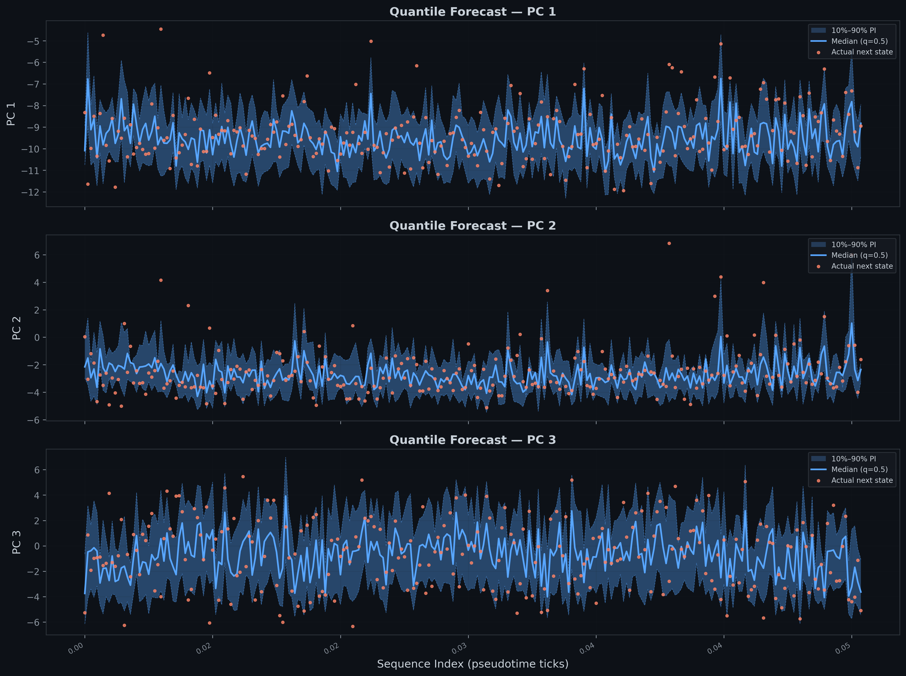

# Waddington: Developmental Trajectory Modeling

## Overview

This project explores a transformer-based approach to modeling developmental trajectories, drawing inspiration from the classic Waddington epigenetic landscape. By learning from state transitions, the system models the complex flow of cell populations through developmental space, mapping out lineage commitments and intermediate states.

## Why This Exists

Understanding how cells differentiate and move through various states is a fundamental challenge in developmental biology. While traditional single-cell analysis often provides static snapshots, this project aims to model the continuous *flow* between these states. By treating developmental progression as a dynamic trajectory, we can intuitively visualize lineage commitments, uncertainty, and the geometric structure of differentiation.

## Core Idea

The core of this project is learning developmental flow over cell-state landscapes. It conceptualizes differentiation as movement across a manifold, driven by developmental progression (pseudotime). By incorporating uncertainty-aware predictions, the model highlights not just where cells are likely to go, but also the critical regions of ambiguity where developmental fate is yet to be decided. The result is a probabilistic representation of lineage flow and developmental progression.

## Key Features

* **Trajectory Forecasting:** Predicting future cell states based on developmental context.
* **Pseudotime Dynamics:** Tracking lineage evolution and population composition over time.
* **Uncertainty Estimation:** Highlighting ambiguous transition regions in the developmental manifold.
* **Manifold Visualization:** Generating Waddington-style 3D landscapes and 2D flow fields to visually explore differentiation geometry.

## Visualization Showcase

The following visualizations illustrate how the model interprets developmental state space, trajectory flow, and prediction uncertainty.

### Developmental Landscape



This visualization represents developmental progression as a topographical landscape. Following Waddington's metaphor, cells move from high-potential undifferentiated states into distinct attractors representing terminal fates. The geometry of the surface is shaped by pseudotime and learned transition dynamics, providing an intuitive view of developmental commitment.

### Developmental Flow Field



This flow field shows the learned developmental movement across a 2D projection of the state space. The streamlines capture trajectory flow and the underlying branching structure of differentiation, offering a vector-field intuition for how cell populations navigate complex transitions.

### Uncertainty Landscape



This uncertainty map highlights regions where developmental fate remains ambiguous. The model's uncertainty-aware prediction isolates critical transition states and branch points where cells have not yet committed to a specific lineage, reflecting biological plasticity.

### Fate Dynamics Across Pseudotime



This visualization tracks population-level lineage evolution over pseudotime. It illustrates how the composition of cell states changes as development progresses, capturing the temporal dynamics of fate commitment from a macroscopic perspective.

### Supporting Diagnostics





These diagnostic plots evaluate the model's forecasting behavior. The phase portrait captures the local trajectory geometry of specific lineages, while the quantile fan chart illustrates the probabilistic forecasting behavior, providing prediction intervals to interpret forecasting confidence.

## Repository Structure

```text
├── core/             # Core modeling components
├── scripts/          # Inference and training orchestration
├── plots/            # Visualization and plotting modules
├── outputs/          # Generated model outputs and visualizations
└── README.md         # Project documentation
```

## Running The Project

To run the inference pipeline and generate the core visualizations:

```bash
# Execute inference and generate plots in the outputs/ directory
python scripts/infer.py
```

## Outputs

Running the pipeline will generate:
* State transition predictions and latent embeddings
* Waddington landscape surface visualizations
* Developmental stream plots and flow fields
* Uncertainty maps and phase portraits
* Fate-flow evolutionary dynamics

## Future Directions

This remains an exploratory, research-inspired project. Future directions include refining the representation of highly uncertain transition boundaries, exploring alternative loss formulations for complex branching structures, and improving the temporal resolution of pseudotime dynamics. 

## License

[MIT License](LICENSE)
